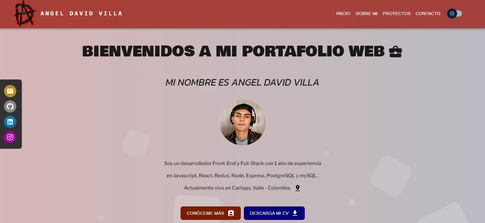
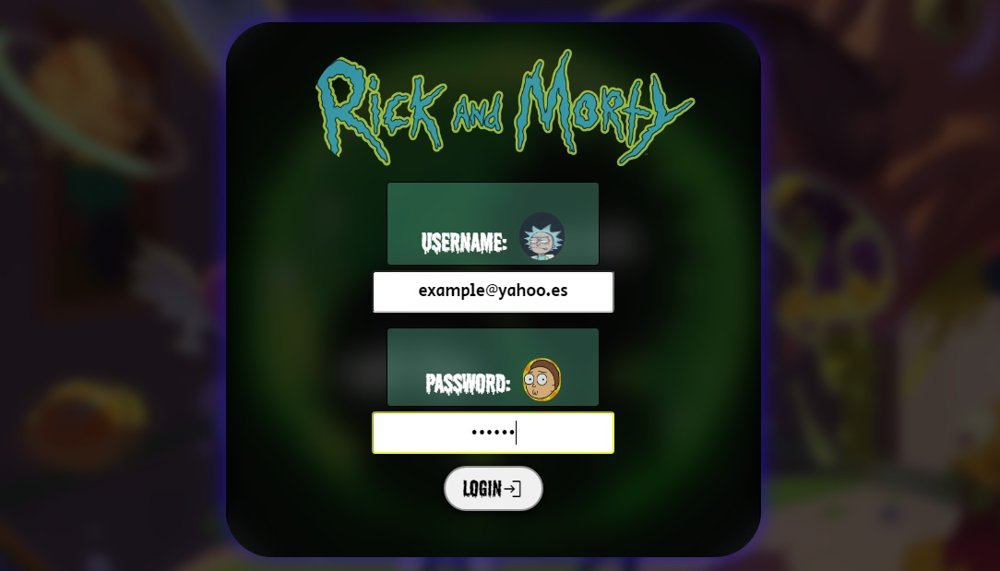
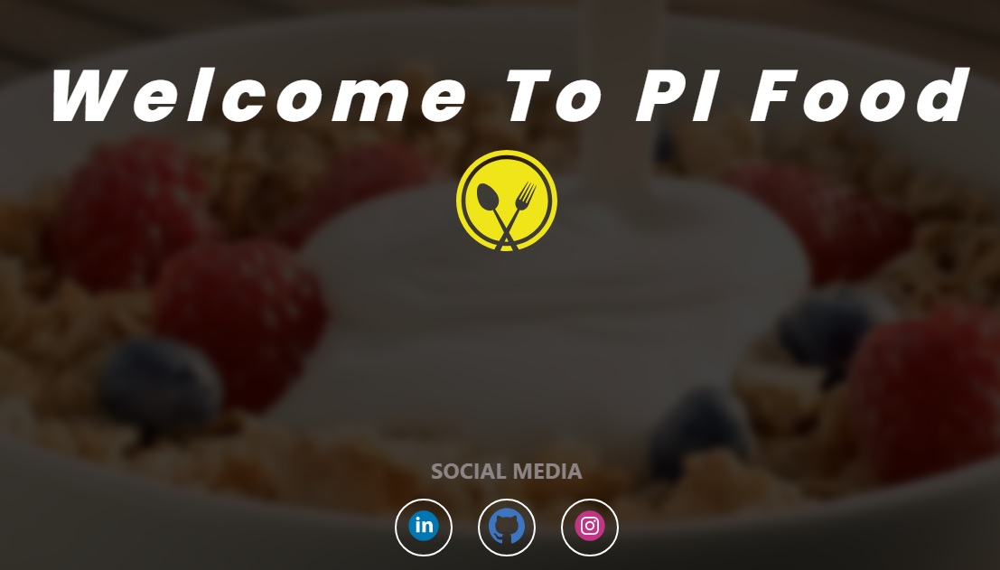
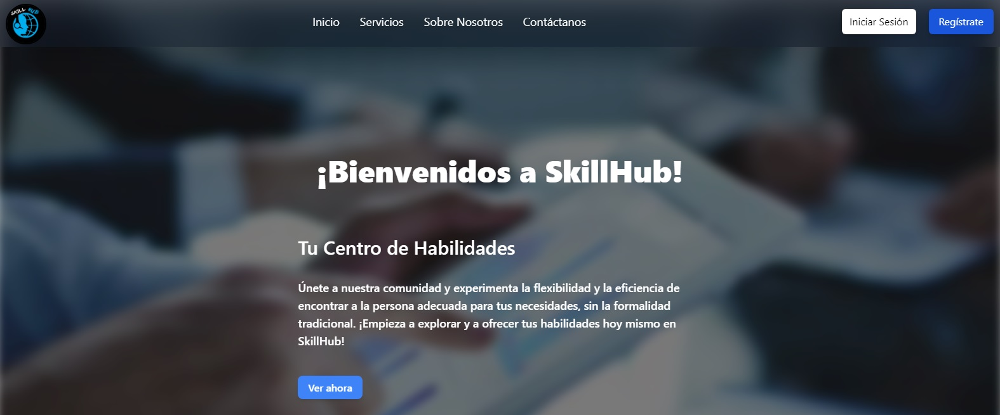
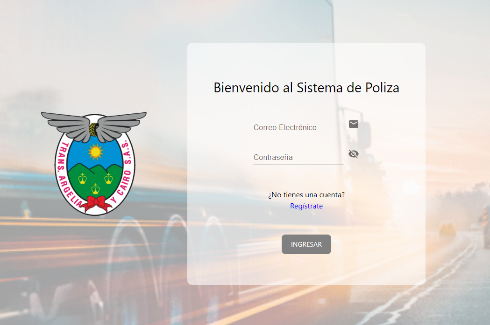

# Mi Portafolio Web

¡Hola! Soy Angel David Villa, Soy un joven apasionado por el mundo TI, tengo un fuerte deseo de aprender y crecer en este campo continuamente. En este repositorio, comparto algunos de mis proyectos y te invito a explorar mi trabajo.

## Acerca de Mí

Soy un entusiasta del desarrollo web con una pasión por crear interfaces dinámicas e interactivas que aportan valor a los usuarios. Como profesional, me considero una persona analítica y orientada a resultados. Tengo la habilidad de desglosar problemas complejos y encontrar soluciones efectivas. Mi enfoque metódico y detallista me permite entregar resultados de alta calidad que cumplen con los objetivos establecidos.

## Tecnologías

- **Frontend:**
  - React
  - Vite
  - Redux
  - Material-UI

  
   
  
  

## Proyectos Destacados

Aquí encontrarás una selección de proyectos en los que he trabajado. Cada proyecto refleja mi dedicación a la calidad y la creatividad.

- **Proyecto 1:** [Proyecto Integrador Rick and Morty](https://www.youtube.com/watch?v=aWysHjkim5I)

  - Una Single Page Application (SPA) donde se renderizan cards de la serie de televisión Rick and Morty

- **Proyecto 2:** [Proyecto Individual - Foods](https://pi-foods-angel.netlify.app/)

  - Una Single Page Application (SPA) donde se renderizan distintas recetas desde Spoonacular Recipes and Foods API y la base de datos creada con PostgreSQL..

- **Proyecto 3:** [Proyecto Final - SkillHub](https://skillhub-production.netlify.app/)

  - Es una página web que tiene como objetivo principal conectar a las personas que necesitan realizar un trabajo ocasional con aquellas que tienen la capacidad de llevar a cabo ese trabajo. Hemos logrado crear una plataforma que no solo resuelve un problema común, sino que también promueve la colaboración y la conexión de talento

- **Proyecto 4:** [Gestión de Valores de Polizas](https://github.com/angeldvilla/sarmicro_front)
  - El objetivo principal del sistema es optimizar la gestión de pólizas, permitiendo a la empresa llevar un control detallado y efectivo de las coberturas, vencimientos y demás aspectos relevantes.

## Cómo Contactarme

Estoy siempre interesado en nuevas oportunidades de colaboración y en conectarme con otros apasionados del desarrollo web o empresas. Si deseas colaborar o charlar, ¡no dudes en contactarme!

- Correo Electrónico: [Gmail](https://mail.google.com/mail/?view=cm&fs=1&to=escarlata.2003@gmail.com)
- LinkedIn: [Angel David Villa Luján](https://www.linkedin.com/in/angel-david-villa-luj%C3%A1n-396634255/)
- Otros Enlaces Sociales: [Instagram](https://www.instagram.com/_angeldvilla_)

## Capturas de Pantalla

Aquí algunas capturas de pantalla de mis proyectos:

Espero que disfrutes explorando mi portafolio. ¡Gracias por visitar!

## Licencia

Este proyecto está bajo la Licencia MIT.

---
